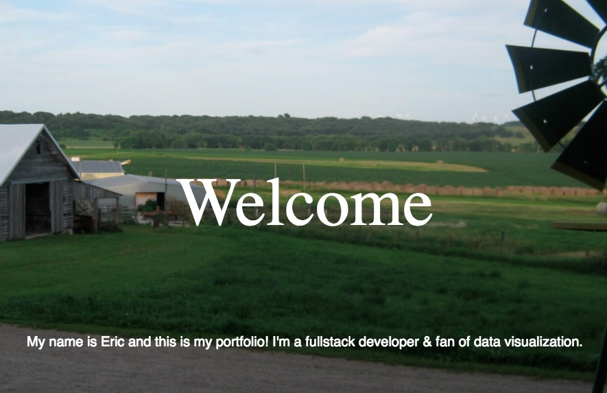
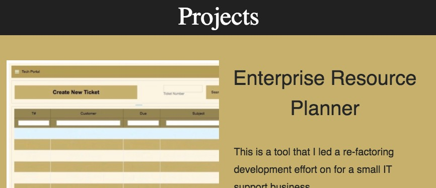
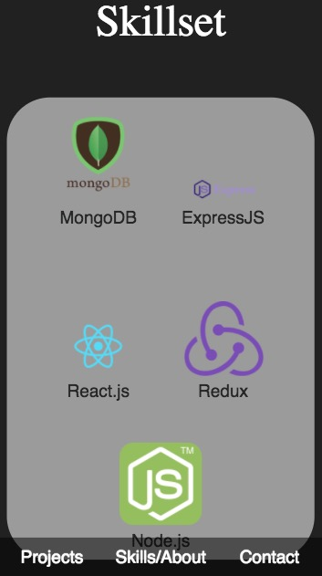
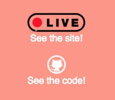

## Portfolio Screenshots

   
## An overview of some projects 
Included are: 
	- Enterprise Resource Planner (ERP) 
		A ticket-based management system that includes invoice development & processing, as well as employee time-tracking & management.  
	- vinFinder 
		An app that reports data on cars with specific vins (vehicle identification numbers).  
	- sayWhat 
		An analytical look at speeches, currently presidential inaugural addresses.  
	- MacroRecipes 
		Find recipes based on minimum and maximum macro nutrient values (fats, calories, carbohydrates and protein).  
	- myMiles 
		Track miles driven in your vehicle.  
	- Jazz Quizz 
		Test your Jazz Trivia with this fun quiz app!   

## An overview of the Skills I've used in these projects
My favorites as of recent include react, redux, D3 and mongoDB.